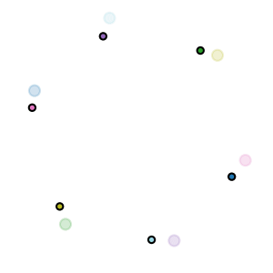
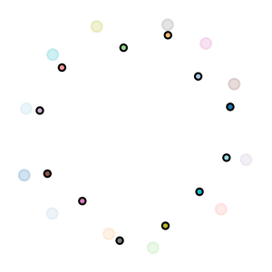
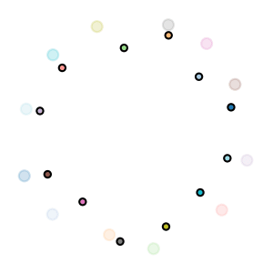
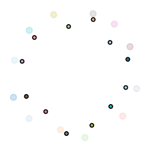
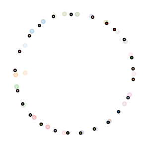
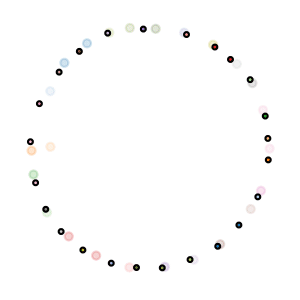
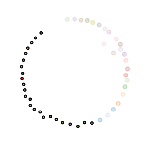
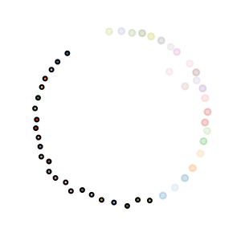

# Human-Inspired Multi-Agent Navigation using Knowledge Distillation

This is the code repository to support the paper _Human-Inspired Multi-Agent Navigation using Knowledge Distillation_.

_**Abstract**_ -- Despite significant advancements in the field of multi-agent navigation, agents still lack the sophistication and intelligence that humans exhibit in multi-agent settings. In this paper, we propose a framework for learning a human-like general collision avoidance policy for agent-agent interactions in fully decentralized, multi-agent environments. Our approach uses knowledge distillation with reinforcement learning to shape the reward function based on expert policies extracted from human trajectory demonstrations through behavior cloning. We show that agents trained with our approach can take human-like trajectories in collision avoidance and goal-directed steering tasks not provided by the demonstrations, outperforming the experts as well as learning-based agents trained without knowledge distillation. 

Comparisons of human trajectories collected by motion capture (Reference), our approach (Ours) and typical reinforcement learning without knowledge distillation (RL w/o KD) and Optimal Reciprocal Collision Avoidance (ORCA):

| Reference | Ours | RL w/o KD | ORCA |
|-----------|------|-----------|------|
|  |  |  |  |
|  |  |  |  |
|  |  |  |  |
|  |  |  |  |

## Dependencies

- Pytorch 1.8
- Numba 0.52
- Matplotlib 3.3.4

We recommend to install all the requirements through Conda by

    $ conda create --name <env> --file requirements.txt -c pytorch -c conda-forge

## Pre-trained Policies

We provide the pre-trained action policy in the folder `pretrain`. To visualize the action policy, please run `visualize.py`:

    $ python visualize.py --ckpt pretrain/policy/ckpt --scene <scene>

The supported scenarios for `scene` option include: `20-circle`, `24-circle`, `20-corridor`, `24-corridor`, `20-square` and `24-square`.

## Code Usage

Our training has two stages: (1) train the expert policy by behavior cloning through supervised learning; and (2) train the general action policy using reinforcement learning and knowledge distillation from the expert policy. 

### Train Expert Policy

    $ python train_expert.py --device cuda:0 --log_dir <expert_log_dir>

### Reinforcement Learning 

We, by default, use DPPO with 8 workers. To run workers on different machines, use the option of `--master_addr` and `--master_port`. Thread with rank 0 is the chief (master) worker.

    $ python train_policy.py --rank 0 --world_size 8 --device cuda:0 --expert <expert_log_dir> --log_dir <policy_log_dir> &
    $ python train_policy.py --rank 1 --world_size 8 --device cuda:0 --expert <expert_log_dir> --log_dir <policy_log_dir> &
    $ python train_policy.py --rank 2 --world_size 8 --device cuda:0 --expert <expert_log_dir> --log_dir <policy_log_dir> &
    $ python train_policy.py --rank 3 --world_size 8 --device cuda:0 --expert <expert_log_dir> --log_dir <policy_log_dir> &
    $ python train_policy.py --rank 4 --world_size 8 --device cuda:0 --expert <expert_log_dir> --log_dir <policy_log_dir> &
    $ python train_policy.py --rank 5 --world_size 8 --device cuda:0 --expert <expert_log_dir> --log_dir <policy_log_dir> &
    $ python train_policy.py --rank 6 --world_size 8 --device cuda:0 --expert <expert_log_dir> --log_dir <policy_log_dir> &
    $ python train_policy.py --rank 7 --world_size 8 --device cuda:0 --expert <expert_log_dir> --log_dir <policy_log_dir> &

